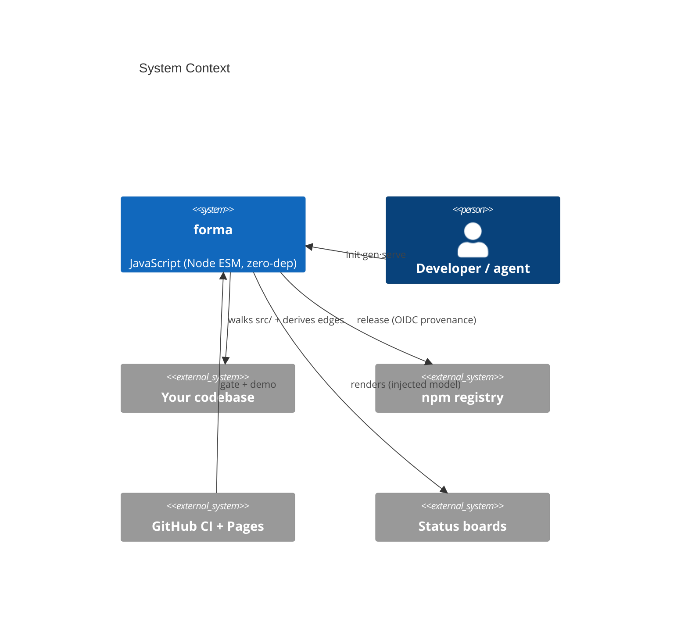
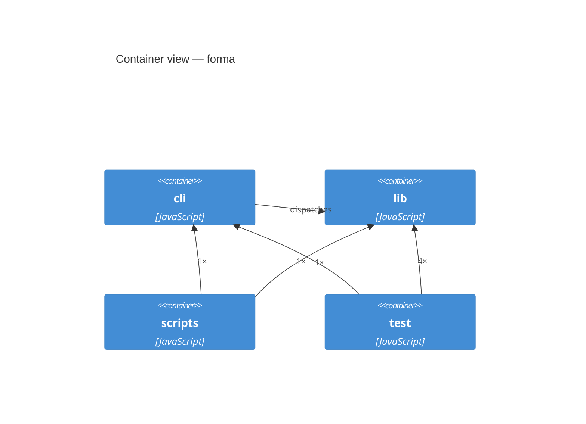

# Architecture — forma

> **Format:** [arc42](https://arc42.org/) + [C4](https://c4model.com/). The deterministic diagrams and
> the building-block table are projected from [`c4-model.json`](c4-model.json) by `forma doc`
> (see [`c4-topology.json`](c4-topology.json) for the curated source). Do not hand-edit those —
> re-run `forma doc` to regenerate the scaffold, then re-merge prose. `forma check` fails if the
> model drifts from the code. This is Forma documenting itself (dogfood).

## 1. Introduction and Goals

Forma is a zero-dependency Node ESM CLI (`forma-arch`, binary `forma`) that turns a codebase into
an interactive, stack-agnostic C4 architecture explorer and keeps it honest with a deterministic
drift check. Users: developers and AI agents who want the architecture picture to match the code.

| Quality goal | Driver |
|---|---|
| The model never lies | `forma check` fails on drift (deterministic, no AI scoring) |
| Trivial to adopt | zero runtime deps, one `npx`, no build step |
| Stack-agnostic | language-detected source walk + name-reference edges, not import syntax |
| Tiny review surface | no network calls in `gen`/`check`; the engine is plain Node |

## 2. Architecture Constraints

- **Language/runtime:** JavaScript, Node ESM, `engines.node >= 18`, **zero runtime dependencies**.
- **Single source of truth:** `docs/architecture/c4-model.json`, validated by
  [`lib/schema/c4-model.schema.json`](../../lib/schema/c4-model.schema.json).
- **Distribution:** npm package `forma-arch`; releases via OIDC trusted publishing + provenance
  (see [`PUBLISH.md`](../../PUBLISH.md)).
- **Determinism:** `gen`/`check` are code-computed; same code + topology ⇒ identical model.

## 3. Context and Scope

- **In scope:** walking a repo's source into a C4 model, deriving container edges from code
  references, drift-checking, projecting an arc42 doc, serving the interactive viewer.
- **Out of scope:** running anything but the user's repo; network calls; LLM-based scoring.

## 4. Solution Strategy

| Decision | Why |
|---|---|
| Walk source live, curate topology by hand | auto-structure is always current; humans curate meaning |
| Derive edges from name references, not imports | language-agnostic; additive, never removes curated edges |
| One JSON model, two renderings (viewer + arc42) | single source of truth; renderings are cheap projections |
| Deterministic drift check | the picture is falsifiable against the code — no stale slides |
| Zero runtime deps + no network in core | minimal supply-chain and review surface |

## 5. Building Block View

| Container | Tech | Leaves | What it does |
|---|---|---|---|
| cli | JavaScript | 1 | CLI entrypoint — dispatches init | gen | check | doc | serve | verify. |
| lib | JavaScript | 13 | Engine — the six commands, the C4 JSON-schema contract, and the interactive viewer. |
| scripts | JavaScript | 2 | Zero-dependency gates — lint and the prepack .fuse_hidden clean-check. |
| test | JavaScript | 2 | Test runner — exercises init→gen→check across the fixtures, plus a gh stub for verify. |

- **cli** (`bin/forma.mjs`) — thin dispatcher; parses the command and delegates to `lib/`.
- **lib** — the engine: `init.mjs` (seed topology), `gen.mjs` (walk + derive edges + emit model),
  `check.mjs` (drift gate), `doc.mjs` (arc42 projection), `serve.mjs` (local viewer), `verify.mjs`
  (state refreshed from live GitHub issues), plus the shared pieces `cluster.mjs`, `describe.mjs`,
  `docmap.mjs`, `enrich.mjs`, `lang.mjs`, `render.mjs`, `validate.mjs`, the JSON schema, and
  `lib/viewer/c4-hologram.html` (the interactive explorer with swappable skins).
- **scripts** — `lint.mjs` (zero-dep lint, 16 files) and `check-clean.mjs` (the `prepack` guard
  that refuses to publish `.fuse_hidden`/editor artifacts).
- **test** — `run.mjs` runs the full `init→gen→check` path across six fixtures — `mini`
  (2 containers, 5 leaves, 1 derived edge), `data-noise`, `docmap`, `flat-python`, `go-nested`,
  `virgin-kebab` — and asserts they stay green.

## 6. Runtime View

`forma gen`: read topology → for each leafSource, list matching files → emit leaves; derive
container↔container edges → write `c4-model.json`. Edge derivation is per-language (`lib/lang.mjs`):
where the language declares its dependencies, forma reads the declaration — on **Go** the leaf is
the package and every edge comes from an `import` block, so the direction is right by construction.
Every other stack falls back to counting cross-references to exposed names, which is a heuristic and
undirected in principle.
`forma check`: re-walk leaves, verify counts/evidence/edges match the model → exit non-zero on drift.

## 7. Deployment View

Forma runs locally in the user's repo (`npx forma-arch` or `npm i -D forma-arch`). `forma serve`
hosts the static viewer at `http://localhost:4173`. There is no server component or remote call.

## 8. Cross-cutting Concepts

- **Validation:** `gen` (after writing) and `check` both validate the model against
  `lib/schema/c4-model.schema.json`, via `lib/validate.mjs` — a zero-dependency walker over the
  keyword subset that schema uses (`type`, `required`, `properties`, `additionalProperties`,
  `items`, `enum`, `minItems`, `minimum`/`maximum`, `pattern`). `format` stays an annotation, as in
  draft-07; it is not a general JSON Schema engine.
- **Security:** no network calls, no `eval`, no deps; the review surface is the lib itself.
- **Persistence:** files only (`c4-topology.json` curated, `c4-model.json` generated, `ARCHITECTURE.md`).
- **Error handling:** scripts fail closed (`process.exit(1)` with a `[forma …]`/`[gen-c4]` message).

## 9. Architecture Decisions

Recorded as ADRs in [`docs/adr/`](adr/) — see the [index](adr/README.md). Key ones: zero-dependency
ESM (ADR-0001), single source of truth `c4-model.json` (ADR-0002), npm OIDC trusted publishing
with provenance (ADR-0003).

## 10. Quality Requirements

- `forma check` is deterministic: same repo + topology ⇒ identical verdict.
- `npm run lint` + `npm test` green on Node 18/20/22 (CI matrix).
- `npm pack --dry-run` stays at 17 files, zero `.fuse_hidden` (enforced by `prepack`).

## 11. Risks and Technical Debt

- Edge derivation is heuristic (name references); curated edges in topology always win.
- `forma init` ignores common build dirs (`bin`, `dist`, …) — curate the topology to add them.

## 12. Glossary

- **C4** — context / container / component / leaf levels (c4model.com).
- **arc42** — the architecture-doc template this file follows (arc42.org).
- **topology** — the curated `c4-topology.json` (containers, leafSources, edges, descriptions).
- **model** — the generated `c4-model.json` (the single source of truth for renderings + check).
- **drift** — the model no longer matching the code; `forma check` fails on it.