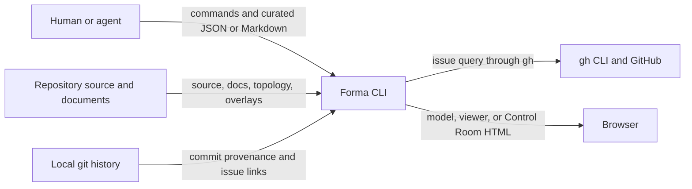
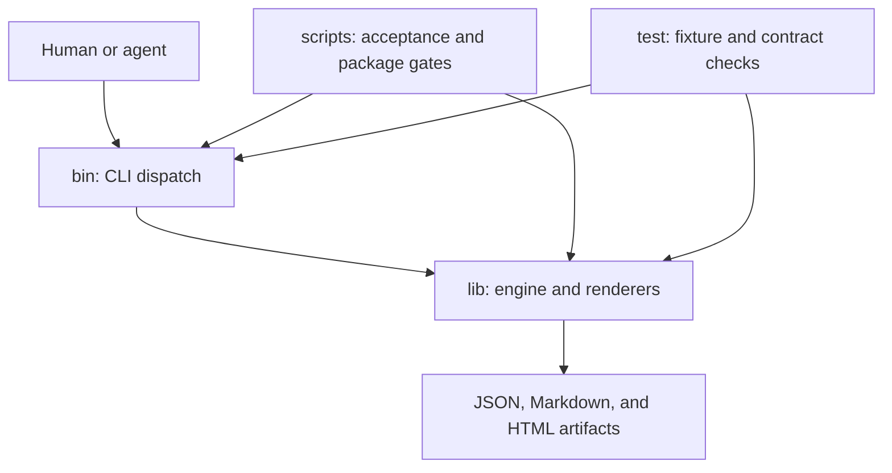
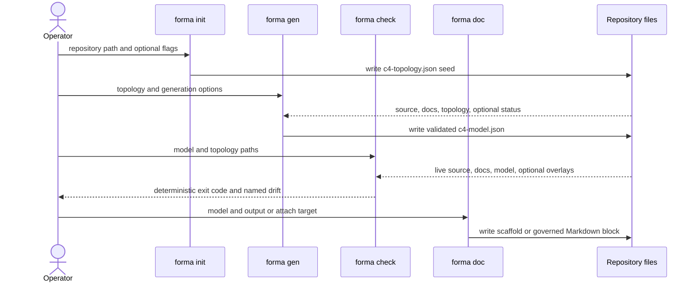
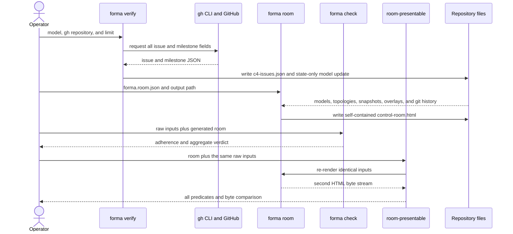

# Forma Architecture

This document follows arc42. It describes the implementation on `feat/control-room`, including the Control Room extension, and separates code-derived facts from judgments and unproved claims.

## 1. Introduction and goals

Forma (`forma-arch`, binary `forma`) is a zero-runtime-dependency Node ESM CLI that turns repository evidence into an interactive, stack-agnostic C4 explorer. Its central purpose is not diagram generation by itself. It is to make architecture claims falsifiable against source code, repository documents, git history, and, when explicitly requested, GitHub issue facts. The product statement and drift promise are recorded in [`README.md:7-10`](../../README.md#L7-L10) and the CLI dispatch is visible at [`bin/forma.mjs:15`](../../bin/forma.mjs#L15).

The stakeholders are:

- Developers and maintainers, who need a current map and a deterministic failure when it drifts.
- Human and AI agents, who curate topology, descriptions, status, and audit judgments through the same JSON and Markdown contracts.
- Technical and programme stakeholders, who read the explorer or Control Room without needing to inspect source first.
- Release and security maintainers, who need a small package, bounded network behavior, and provenance.

| Quality goal | Why it matters |
|---|---|
| Truth before completeness | An unknown or partial answer is safer than a plausible false claim. |
| Deterministic verification | Two runs over the same facts must reach the same verdict, so the gate is reviewable and reproducible. |
| Evidence at the point of claim | A color, status, description, or issue link must say where it came from. |
| Legibility from context to leaf | The output must work as an explanation, not merely as a machine inventory. |
| Low adoption and supply-chain cost | A source-reading tool should not bring a dependency tree or hidden network behavior into a repository. |

## 2. Constraints

- **Zero runtime dependencies and no build step.** The package uses Node built-ins only, because every dependency would enlarge the supply-chain and review surface. This is the accepted constraint in [ADR-0001](../adr/0001-zero-dependency-esm.md) and is declared by [`package.json:26-46`](../../package.json#L26-L46).
- **Node ESM.** The package is `type: module`, exposes `bin/forma.mjs`, and supports Node 18 or newer ([`package.json:26-42`](../../package.json#L26-L42)).
- **Offline deterministic core.** `init`, ordinary `gen`, `check`, `doc`, `serve`, `room`, linkage, taxonomy, and audit application do not fetch remote facts. `verify` is the explicit GitHub fact-fetching command. Opt-in `gen --enrich` providers may call an LLM endpoint, but enrichment is prose-only, cached, and excluded from the deterministic gate ([`lib/enrich.mjs:2-5`](../../lib/enrich.mjs#L2-L5), [`lib/verify.mjs:2-5`](../../lib/verify.mjs#L2-L5)).
- **Determinism with named volatile inputs.** A normal `gen` run varies only `generatedAt`; repository commit and branch are input provenance. Control Room time comes from manifest `today`, not the wall clock ([`lib/gen.mjs:399-404`](../../lib/gen.mjs#L399-L404), [`lib/roomderive.mjs:1-5`](../../lib/roomderive.mjs#L1-L5)).
- **File contracts over hidden state.** Topology, model, status, issue snapshot, health, findings, and room manifest are explicit files. This lets humans, agents, CI, and browsers use the same artifacts.

## 3. Context and scope

Forma talks to a repository and local tools. It is not a hosted service.

- The repository supplies source structure, capability tables, architecture prose, curated topology, and optional overlays.
- Local git supplies commit identity and the issue to commit to file to C4-node link. This avoids a second hand-maintained mapping ([`lib/link.mjs:1-5`](../../lib/link.mjs#L1-L5)).
- The `gh` CLI is the only path for live programme facts. Forma receives issue and milestone JSON, then writes an offline snapshot ([`lib/verify.mjs:39-47`](../../lib/verify.mjs#L39-L47)).
- An agent may curate files or answer generated enrichment and audit plans. The core does not depend on which model, if any, performs that work.
- A browser consumes the static explorer or self-contained Control Room. `serve` is only a small local static server ([`lib/serve.mjs:16-27`](../../lib/serve.mjs#L16-L27)).

The scope excludes executing target code, becoming an issue tracker, inferring semantic project truth from label names, and silently refreshing remote facts during generation or checking.

## 4. Solution strategy

| Shaping decision | Why it shapes the system | Decision record |
|---|---|---|
| Use only Node built-ins and ship source directly. | Adoption stays one command, behavior has no bundle layer, and the dependency review surface stays empty. | [ADR-0001](../adr/0001-zero-dependency-esm.md) |
| Keep `c4-model.json` as the architecture single source of truth. | Viewer and arc42 output become projections, while `check` can compare one committed claim with independent evidence. | [ADR-0002](../adr/0002-single-source-of-truth-model.md) |
| Publish from a tag through npm OIDC with provenance. | Releases need no long-lived npm token and remain attributable to the public workflow. | [ADR-0003](../adr/0003-npm-oidc-trusted-publishing.md) |
| Make the Control Room another deterministic rendering, not another model. | `gen` remains the only architecture-model writer; new programme facts use overlays with separate lifecycles; existing repositories gain no new failure mode unless those files are present. | [ADR-0004](../adr/0004-control-room-as-a-forma-rendering.md) |

Two supporting rules follow from these decisions. Where a language declares architecture, Forma reads the declaration, as with Go packages and import blocks. Elsewhere it uses a documented additive heuristic. Where reality is not measured, Forma emits `unknown`, `null`, or no percentage rather than converting absence into zero.

## 5. Building block view

### Level 1: system

Forma is one local CLI system. It reads repository facts and writes reviewable architecture artifacts. There is no application server, database, or background worker.

### Level 2: repository containers

| Container | Single responsibility | Why it is separate |
|---|---|---|
| `bin/` | Dispatch a public subcommand to its engine script. | The public CLI surface stays thin and inspectable. |
| `lib/` | Implement generation, verification, derivation, validation, and rendering. | All product behavior lives in the shipped runtime surface. |
| `scripts/` | Grade syntax, package cleanliness, viewer presentability, and Control Room presentability. | Artifact quality is different from architecture adherence, so it has separate instruments. |
| `test/` | Exercise contracts and end-to-end fixture flows without runtime dependencies. | Tests may use temporary repos and a `gh` stub without entering the package. |

### Level 3: engine modules

The 18 top-level `lib/*.mjs` modules each have one primary responsibility:

| Module | Single responsibility |
|---|---|
| `audit.mjs` | Plan audits and apply only verdicts whose evidence resolves. |
| `check.mjs` | Re-derive independent facts and fail when committed architecture or optional room artifacts disagree. |
| `cluster.mjs` | Resolve container ancestry and synthesize deterministic prefix groups. |
| `describe.mjs` | Resolve one node description through the ordered provenance chain. |
| `doc.mjs` | Project an arc42 scaffold or attach a governed generated block to an existing document. |
| `docmap.mjs` | Join capability-table rows to nodes and derive cited descriptions and programme verdicts. |
| `enrich.mjs` | Fill remaining prose holes through explicit, cached, opt-in enrichment. |
| `gen.mjs` | Combine curated topology with live repository evidence and write the validated C4 model. |
| `init.mjs` | Seed a best-effort topology and disclose source stacks it did not model. |
| `lang.mjs` | Provide language-specific topology and edge facts, currently Go packages and imports. |
| `link.mjs` | Derive issue to code ownership from commit subjects and touched files. |
| `render.mjs` | Render the deterministic arc42 block shared by `doc` and `check`. |
| `room.mjs` | Validate one portfolio manifest and compose one self-contained Control Room HTML file. |
| `roomderive.mjs` | Compute all repository and portfolio Control Room aggregates for both writer and checker. |
| `serve.mjs` | Serve architecture files and the fallback viewer locally with traversal protection. |
| `taxonomy.mjs` | Detect label families by syntax and population without semantic inference. |
| `validate.mjs` | Validate the shipped schema subset and materialize typed cumulative timelines. |
| `verify.mjs` | Fetch GitHub issue facts through `gh`, snapshot them, and update model state without changing structure. |

The modules share five schemas under `lib/schema/`, one architecture contract plus four Control Room contracts. The two HTML files under `lib/viewer/` are static renderers: `c4-hologram.html` for one architecture model and `control-room.html` for a portfolio briefing.

## 6. Runtime view

### Core generation, checking, and documentation

`init -> gen -> check` separates a best-effort seed, a generated claim, and an independent re-derivation. This matters because a generator cannot prove itself merely by reading its own output. `gen -> doc` keeps prose projection downstream of the model; attach mode also records the target in `source.attachedDocs`, so deleting the generated markers does not silently remove governance ([`lib/doc.mjs:71-96`](../../lib/doc.mjs#L71-L96), [`lib/check.mjs:93-118`](../../lib/check.mjs#L93-L118)).

### Live programme facts and Control Room publication

The boundary data is explicit:

| Transition | Data crossing the boundary | Reason |
|---|---|---|
| `verify -> room` | Timestamped `c4-issues.json`, plus state-only updates in `c4-model.json`. | Remote facts become an offline-replayable input before composition. |
| `room -> check` | `control-room.html` with embedded machine-readable derivations, plus manifest and raw overlays. | `check` compares shared derivations, not fragile rendered markup ([`lib/check.mjs:220-249`](../../lib/check.mjs#L220-L249)). |
| `check -> room-presentable` | A code-adherent input set and the rendered artifact. | Adherence and briefing quality answer different questions and therefore have different gates. |
| `room-presentable -> result` | Every predicate result plus a second byte stream from identical inputs. | Running all predicates prevents one early failure from hiding later defects; byte equality catches template nondeterminism. |

## 7. Deployment view

Forma is installed locally with `npx forma-arch` or as a development dependency. The npm package is selected by [`package.json:33-39`](../../package.json#L33-L39): `bin/forma.mjs`, all of `lib/`, `LICENSE`, `NOTICE`, `README.md`, and npm's package metadata ship. Repository docs, tests, scripts, fixtures, and GitHub workflows do not ship. A current `npm pack --dry-run --json` reports 30 package entries; this conflicts with the hard-coded 20-file statement in `AGENTS.md` and is recorded as debt in section 11.

GitHub Pages is a separate static deployment. On pushes to `main`, it copies only `lib/viewer/c4-hologram.html` and the committed `docs/demo/c4-model.json`, runs the single-model presentation gate, and deploys `_site` ([`.github/workflows/pages.yml:38-52`](../../.github/workflows/pages.yml#L38-L52)). It does not regenerate the private-source demo and does not publish a Control Room.

Release deployment starts with a `v*` tag. The workflow checks that the tag matches `package.json`, runs lint and tests, and calls `npm publish` with `id-token: write` and no long-lived npm token ([`.github/workflows/release.yml:18-31`](../../.github/workflows/release.yml#L18-L31)). [ADR-0003](../adr/0003-npm-oidc-trusted-publishing.md) records why OIDC and provenance are required.

## 8. Cross-cutting concepts

### Model as the single source of truth

`c4-model.json` is the generated architecture authority. Topology and source are independent inputs used to regenerate and check it; the explorer, arc42 block, and Control Room consume it. New programme facts remain overlays with their own schemas and lifecycles, so the closed node and edge contract does not become a dumping ground. This extends [ADR-0002](../adr/0002-single-source-of-truth-model.md) through [ADR-0004](../adr/0004-control-room-as-a-forma-rendering.md).

### Evidence and citation

Descriptions record `descSource`; document-derived state records its source and coverage; issue linkage follows `#N` in a commit subject to touched files and then C4 ownership; audit verdicts require path, commit, or issue evidence. The implementation rejects missing paths and unresolvable commits before applying an audit fill ([`lib/audit.mjs:32-58`](../../lib/audit.mjs#L32-L58)). Evidence is not ornamental metadata. It is what makes a displayed claim reviewable.

### The honest blank

Absence has different meanings and must survive rendering. An undocumented node is `unknown`, a repository without a curated model uses `null` for model-dependent aggregates, and an absent `blockedBy` rule means nobody checked while an empty declared list means checked and none. Percentages appear only when a source can positively establish that it measured one. This prevents an unknown remainder from becoming a false zero or a declaration from becoming a measurement ([`lib/docmap.mjs:205-234`](../../lib/docmap.mjs#L205-L234), [`lib/roomderive.mjs:124-141`](../../lib/roomderive.mjs#L124-L141)).

### Opt-in-by-presence gating

Control Room assertions activate only when their artifacts exist. A repository that never runs `verify` or `room` keeps the previous `check` behavior. This is compatibility by construction, not a feature flag, and is implemented at [`lib/check.mjs:177-227`](../../lib/check.mjs#L177-L227).

### Safe embedding

Issue titles, model prose, and findings are repository-controlled strings. Before injecting JSON into a script element, `room` escapes `<`; before injecting the viewer source, it escapes closing script tags. The embedded architecture viewer runs in an iframe sandbox without same-origin access, preventing a model field from reaching the Control Room shell ([`lib/room.mjs:89-99`](../../lib/room.mjs#L89-L99), [`lib/viewer/control-room.html:321`](../../lib/viewer/control-room.html#L321)). The loss of a cross-frame bridge is deliberate because no view requires one.

## 9. Architecture decisions

| ADR | Status | Decision |
|---|---|---|
| [ADR-0001](../adr/0001-zero-dependency-esm.md) | Accepted | Zero-dependency Node ESM CLI. |
| [ADR-0002](../adr/0002-single-source-of-truth-model.md) | Accepted | One `c4-model.json` as the architecture single source of truth. |
| [ADR-0003](../adr/0003-npm-oidc-trusted-publishing.md) | Accepted | npm OIDC trusted publishing with provenance. |
| [ADR-0004](../adr/0004-control-room-as-a-forma-rendering.md) | Accepted | Control Room as another Forma rendering, not a second product. |

Accepted ADRs are immutable. A changed decision requires a new ADR that supersedes the old one, as stated in [`docs/adr/README.md:3-4`](../adr/README.md#L3-L4).

## 10. Quality requirements

| Quality requirement | Verification command | Current evidence |
|---|---|---|
| Every shipped JavaScript entry parses. | `npm run lint` | Passes on this branch; the command checks `bin/forma.mjs`, every top-level `lib/*.mjs`, `scripts/lint.mjs`, and `test/run.mjs` ([`scripts/lint.mjs:2-12`](../../scripts/lint.mjs#L2-L12)). |
| Forma's committed model remains adherent to Forma's source. | `node bin/forma.mjs check` | Passes on this branch. CI runs the same command after lint and tests ([`.github/workflows/ci.yml:23-27`](../../.github/workflows/ci.yml#L23-L27)). |
| Generation and contract behavior remain deterministic across fixtures. | `npm test` | The fixture blocks pass through the final external-corpus check, then the known `docmap-cap` defect fails the process. The suite is therefore not globally green. |
| The public single-model demo is suitable for presentation. | `node scripts/presentable.mjs docs/demo/c4-model.json` | The test suite invokes this exact shipped artifact and requires exit 0 ([`test/run.mjs:1407-1411`](../../test/run.mjs#L1407-L1411)). |
| A Control Room is adherent and keeps its briefing promises. | `forma check` followed by `node scripts/room-presentable.mjs ...` | The checker re-derives aggregates through `roomderive.mjs`; the publication gate checks evidence, issue coverage, freshness, closure-rate naming, and identical re-render bytes ([`scripts/room-presentable.mjs:93-109`](../../scripts/room-presentable.mjs#L93-L109)). |
| The npm surface contains only intended runtime files and no editor residue. | `npm pack --dry-run --json` | The prepack guard passes, but the documented file count is stale; see section 11. |
| Releases use the declared version and token-free provenance. | Push a matching `v*` tag and require the `release` workflow to pass. | The workflow checks version equality, lint, tests, and OIDC publish before release. |

## 11. Risks and technical debt

- **The test suite is not green on the available real corpus.** `npm test` currently fails at `docmap-cap`: four rows reported as DONE produce `status2=planned`, while the test expects `done`. The external-corpus assertion and failure point are at [`test/run.mjs:1421-1434`](../../test/run.mjs#L1421-L1434). This is pre-existing and was not changed by this documentation rewrite.
- **Static line references rot, and did.** `docs/ORIENTATION.md` accumulated wrong line numbers and two false claims (the viewer at 746 lines when it is 1068; the model never validated against its schema, which [`lib/check.mjs`](../../lib/check.mjs) has done since the schema landed). It was removed on this branch in favour of [`INVARIANTS.md`](../INVARIANTS.md), which pairs each rule with an executable enforcement point. Line citations remain useful evidence at a reviewed commit; they are not a substitute for a check that runs.
- **The shipped-file count is a prose invariant.** `AGENTS.md` says `npm pack --dry-run` must stay at 20 files ([`AGENTS.md:38-39`](../../AGENTS.md#L38-L39)); the current dry run reports 30 entries. `scripts/check-clean.mjs` checks only editor residue, not the count ([`scripts/check-clean.mjs:7-10`](../../scripts/check-clean.mjs#L7-L10)). The number needs a deliberate update or an executable assertion.
- **Issue-to-code coverage is intentionally partial.** Git can link only issues cited by commits that touch modeled files. Sweeps are excluded and named. Unlinked work remains unknown; it must never be presented as zero.
- **Offline freshness has a hard limit.** `check` can validate shape and reject an old snapshot relative to manifest `today`, but it cannot know whether GitHub changed after `fetchedAt`. Only a new `verify` can establish a newer fact base.
- **Heuristic parsing has bounded precision.** Non-Go edges use name references; Go imports and source docstrings use regular expressions rather than language ASTs. This is acceptable for an explorer, not for compiler-grade analysis ([`lib/validate.mjs:1-13`](../../lib/validate.mjs#L1-L13), [ADR-0001](../adr/0001-zero-dependency-esm.md)).
- **Control Room parametricity is not proven across curated models.** One repository exercises the complete mapped path. Additional programme issue corpora were measured, but their Forma models have not been curated and run end to end.

## 12. Glossary

| Term | Meaning |
|---|---|
| C4 | The context, container, component, and leaf hierarchy used to navigate architecture. |
| arc42 | The section structure used by this architecture document and by `forma doc`. |
| Topology | Human-curated architecture input, including nodes, source walks, edges, descriptions, and optional timeline. |
| Model | Generated `c4-model.json`, the architecture single source of truth consumed by renderers and checked against evidence. |
| Overlay | A separately governed file that adds programme status, issue facts, health verdicts, or findings without changing the core model contract. |
| Snapshot | `c4-issues.json`, the timestamped result of one explicit `gh` fetch. |
| Drift | A committed claim no longer matching the independently re-derived repository fact. |
| Honest blank | `unknown`, `null`, or omission used when Forma has no measured basis for a value. |
| Presentable gate | A read-only acceptance instrument that grades rendered claims and usability, distinct from `forma check`. |
| Control Room | A self-contained portfolio briefing rendered from models, overlays, issue snapshots, git linkage, and a manifest. |
